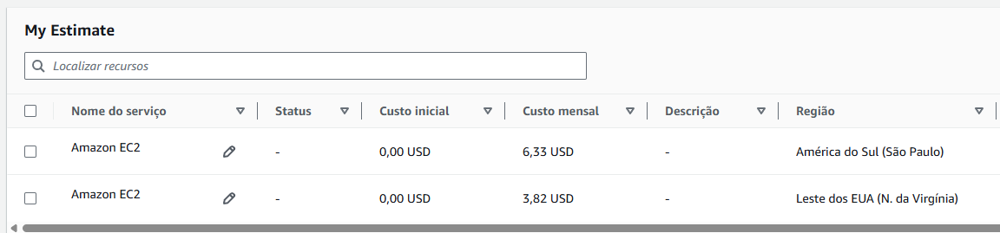
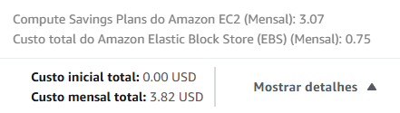
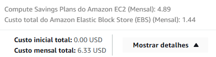

# FarmTech Solutions - Fase 5
## Cap 1 - FarmTech na era da cloud computing

<p align="center">
  
</p>

### **Grupo 36**

| Nome | RM |
|------|-----|
| Felipe Sabino da Silva | RM563569 |
| Juan Felipe Voltolini | RM562890  |
| Luiz Henrique Ribeiro de Oliveira | RM563077 |
| Marco Aurélio Eberhardt Assumpção | RM563348 |
| Paulo Henrique Senise | RM565781 |

### **Professores:**
- **Tutor:** Leonardo Ruiz Orabona
- **Coordenador:** André Godoi

---


## **Licença**

Este projeto é desenvolvido para fins acadêmicos como parte do curso da FIAP.

---

## **Contato**

Para dúvidas sobre o projeto, entre em contato com qualquer membro do **Grupo 36**.

---

<p align="center">
  <strong>FarmTech na era da cloud computing </strong>
</p>

<p align="center">
  <i>Projeto Integrador | Fase 5 | FIAP - 2025</i>
</p>

## **How to Run**

1. Coloque o arquivo `crop_yield.csv` na raiz do repositório.
2. (Opcional) Crie e ative um ambiente virtual.
3. Instale as dependências:

```
pip install -r requirements.txt
```

4. Abra o Jupyter e execute o notebook:

```
jupyter notebook
```

5. O notebook a ser executado é: `MarcoAurelioEberhardtAssumpcao_rm563348_pbl_fase4.ipynb`.

## **Notebook**

Análise completa (EDA, clusterização e cinco modelos de regressão) em `MarcoAurelioEberhardtAssumpcao_rm563348_pbl_fase4.ipynb`.

## **Video**

Link do YouTube aqui: <https://youtu.be/HnQ-IKtIsYo>


## 📊 Entrega 2 – Estimativa de Custos na AWS

**Site utilizado:** [AWS Pricing Calculator](https://calculator.aws/#/addService)  
**Vídeo da apresentação:** [YouTube (não listado)](https://youtu.be/XuxRMm7qeyo)

### 🖥️ Configuração solicitada
- 2 vCPU  
- 1 GiB de memória  
- Até 5 Gigabit de rede  
- 50 GB de armazenamento (HD – EBS sc1)  
- Sistema operacional: Linux  
- Instância escolhida: **t4g.micro** (mais barata, ARM/Graviton)  

### 💵 Estimativas de custo (On-Demand 100%)

| Região            | EC2 (mensal) | EBS 50 GB (mensal) | **Custo total/mês** |
|-------------------|-------------:|-------------------:|--------------------:|
| **N. Virginia (us-east-1)** | ~US$ 3,07 | ~US$ 0,75 | **US$ 3,82** |
| **São Paulo (sa-east-1)**   | ~US$ 4,89 | ~US$ 1,44 | **US$ 6,33** |

📌 Valores obtidos diretamente na **AWS Pricing Calculator** com a configuração descrita.

### Visualizações

**Estimativa Mensal**  


**Participação de custos por região**  
us-east-1 (N. Virginia):  


sa-east-1 (São Paulo):  


### 📌 Comparação e conclusão
- A **opção mais barata** é hospedar a máquina em **N. Virginia**, com custo aproximado de **US$ 3,82 por mês**.  
- Já em **São Paulo**, o custo sobe para cerca de **US$ 6,33 por mês**.  

### ⚖️ Justificativa
- **Financeiramente**, a região dos EUA (N. Virginia) é a mais econômica.  
- **Porém**, se houver **restrição legal para armazenar dados fora do Brasil** e necessidade de **acesso rápido** aos sensores, a melhor escolha é a região de **São Paulo**, mesmo com custo maior.  
- Na prática, para produção, também pode ser considerado o uso de **EBS gp3 (SSD)** em vez de HDD, por oferecer menor latência e melhor desempenho para APIs de Machine Learning.

---


